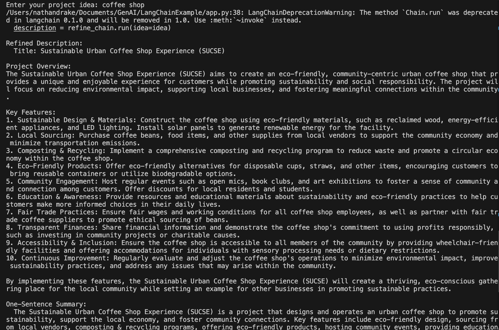

# Idea-to-Pitch Generator

This project is a creative, multi-step AI workflow built with [LangChain](https://github.com/langchain-ai/langchain) and [Ollama](https://ollama.com/).  
It takes your rough project idea and automatically generates:

1. A refined project description  
2. A one-sentence summary  
3. A catchy project name  
4. An elevator pitch

Perfect for hackathons, demos, or brainstorming sessions!

---

## Example Output



---

## Features

- **Runs locally** using open-source models (no API key required)
- **Multi-step orchestration**: Each step builds on the previous one
- **Easy to use**: Just enter your idea and get a full pitch

---

## Setup

### 1. Install Ollama and a model

```bash
brew install ollama
ollama run mistral
```

### 2. Install Python dependencies

```bash
python3 -m venv venv
source venv/bin/activate
pip install langchain-community
```

### 3. Run the app

```bash
python app.py
```

---

## Example Usage

```
Enter your project idea: An app that helps people find local volunteering opportunities.
```

**Output:**
- Refined Description:  
  An application that connects users with nearby volunteering events and organizations based on their interests and location.
- One-Sentence Summary:  
  A platform to easily discover and join local volunteering opportunities.
- Project Name:  
  VolunteerConnect
- Elevator Pitch:  
  VolunteerConnect is your gateway to making a difference in your community. Discover, join, and track local volunteering events tailored to your passions—all in one place!

---

## How it works

This app uses LangChain's `LLMChain` to pass your idea through a series of prompts, each handled by a local LLM via Ollama.

---

## Credits

- [LangChain](https://github.com/langchain-ai/langchain)
- [Ollama](https://ollama.com/)
- [Mistral Model](https://ollama.com/library/mistral) (or any supported model)

---

## License

MIT